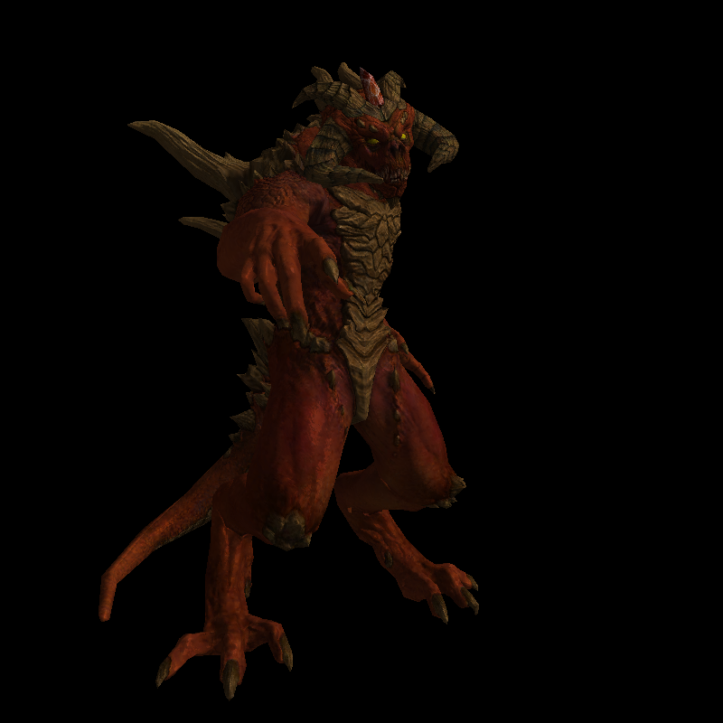

# 🖼️ Renderer From Scratch

**Renderer From Scratch** is a C++ project implementing a modern software rasterizer step by step, exploring the fundamentals of real-time graphics pipelines.  
The project progresses from basic rasterization to advanced geometry processing, including **tangent space computation** for normal mapping.

---

## ✨ Features

- **Triangle Rasterization**
  - Barycentric coordinate–based rasterization.
  - Depth buffering for hidden surface removal.
  - Perspective-correct interpolation of vertex attributes.

- **Lighting Models**
  - **Lambertian diffuse model** for physically intuitive light scattering across surfaces.
  - **Phong reflection model** with ambient, diffuse, and specular terms, simulating glossy reflections.
  - Support for per-fragment normal mapping in tangent space for enhanced realism.

- **Tangent Space Computation**
  - Implemented algorithms to compute per-vertex tangent and bitangent vectors from mesh UVs.
  - Enables consistent per-pixel lighting with normal mapping.

- **Geometry & Mesh Processing**
  - Loading and transforming 3D models.
  - Attribute interpolation (UVs, normals, tangents) across triangle surfaces.

- **Rendering Utilities**
  - Wireframe rendering mode.
  - Camera transformations and perspective projection.
  - Export of rendered images for debugging and analysis.

---

## 🔧 Tech Stack

- **Language:** C++11 (modern features, RAII, smart pointers)  
- **Concepts:** Rasterization, Tangent Space, Normal Mapping, Lambertian Shading, Phong Lighting  
- **Math:** Linear Algebra, Barycentric Coordinates, Geometry Processing  

---

## 🚀 Build & Run

### Requirements
- **CMake** (>= 3.15)  
- C++11-compatible compiler (e.g. GCC, Clang, MSVC)  
- model.obj file, model_diffuse.tga file and model_nm_tangent.tga file

### Build
```bash
cmake -S . -B build
cmake --build build
./build/rendererFromScratch model.obj
```
### Preview


